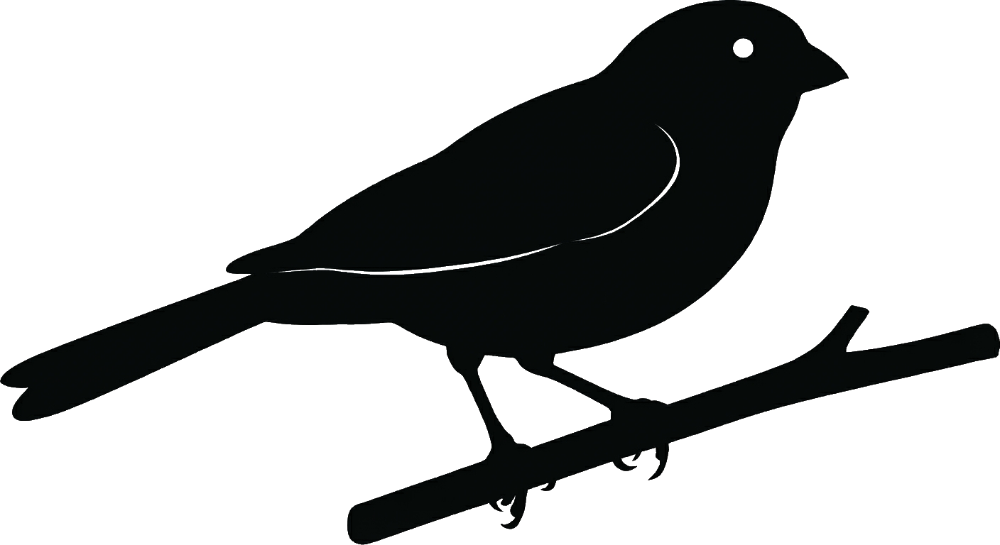

# 🐦 iBirder
### Identificador Inteligente de Aves para Drone e Fotografia



O **iBirder** é uma ferramenta profissional e minimalista projetada para ornitólogos, fotógrafos de natureza e operadores de drone. Ele utiliza Inteligência Artificial de ponta para identificar espécies de aves em fotos e gravar os dados científicos diretamente nos metadados (EXIF/IPTC) do arquivo.

---

## ✨ Destaques Visuais

*   **Design Industrial**: Interface limpa e moderna em tons de Cinza e Grafite.
*   **Modo Escuro/Claro**: O aplicativo detecta automaticamente o tema do seu sistema (Windows ou Linux) e ajusta os ícones para garantir a melhor visibilidade.
*   **Foco na Foto**: Área de arrastar e soltar (Drag & Drop) ampla e intuitiva.

---

## 🚀 Tecnologias

Construído com o que há de mais moderno em 2025/2026:

*   **Python 3.12+**: Performance e estabilidade.
*   **PySide6 (Qt)**: Interface gráfica nativa e fluida.
*   **Google GenAI SDK**: Integração com os modelos Gemini mais recentes para identificação precisa.
*   **ExifTool**: O padrão ouro industrial para manipulação de metadados.

---

## 🛠️ Recursos Principais

1.  **Identificação Híbrida**:
    *   **Offline**: IA local rápida para triagem.
    *   **Online (Google AI)**: Análise profunda e precisa na nuvem.
2.  **Automação de Metadados**: Grava Nome Científico, Nome Comum e Confiança diretamente na foto.
3.  **Auto-Configuração**:
    *   Verifica o ambiente de execução.
    *   **Cria atalhos automaticamente** na Área de Trabalho se não existirem.
4.  **Multiplataforma**: Funciona perfeitamente no **Windows 10/11** e **Linux (Ubuntu/GNOME)**.

---

## 📦 Instalação (Para Desenvolvedores)

Se você é um desenvolvedor e quer contribuir:

```bash
# 1. Clone o repositório
git clone https://github.com/KuriakinToscan/iBirder.git
cd iBirder

# 2. Crie o ambiente virtual
python -m venv .venv

# 3. Ative o ambiente
# Windows:
.venv\Scripts\activate
# Linux:
source .venv/bin/activate

# 4. Instale as dependências
pip install -r requirements.txt
```

---

## 👵 Como Usar (Para Usuários)

**É muito simples:**

1.  Procure o ícone do **iBirder** 🐦 na sua **Área de Trabalho**.
2.  Dê um **duplo clique** para abrir.
3.  **Arraste uma foto** de ave para dentro da janela.
4.  Aguarde a identificação e clique em **GRAVAR DADOS**.

*Se for a primeira vez, o aplicativo pode pedir para criar o atalho para você. Basta clicar em "Sim"!*

---

> **Versão Atual**: v0.1.6
> **Licença**: MIT
